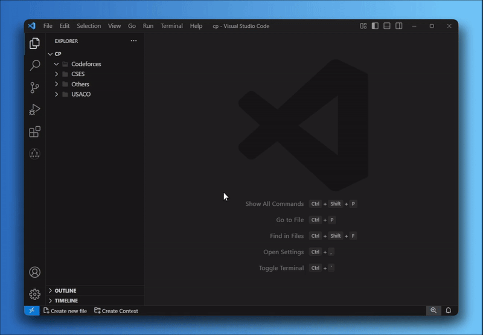

# CP Helper 

A VS Code extension to streamline your competitive programming workflow. Create files and contests, manage test cases, and compile code with ease!

## Usage 💡
### Create New File
- Click on the **Create New File** button in the status bar or run the command `CP Helper: Create New File`.

### Create Contest
- Click on the **Create Contest** button to quickly set up a contest folder.

## Installation 🛠️
Install CP Helper from [this](https://marketplace.visualstudio.com/items?itemName=cp-helper.cp-helper) link, or:
1. Open VS Code.
2. Go to the Extensions view (`Ctrl + Shift + X`).
3. Search for **CP Helper**.
4. Click **Install**.

## Features 
- **Create New File:** Quickly create a new file with a template.
- **Create Contest:** Automatically create contest folders with pre-generated problem files.
- **Test Management:** Add, delete, and run multiple test cases.
- **Status Bar Integration:** Easily access features from the VS Code status bar.
- **Search Problems By Category** Quickly find problems by category and monitor your progress with achievement tracking.

## Suported languages
- C++
- More coming soon...